<!--
  ─────────────────────────────────────────────────────────────
  PROFILOVÉ README · @matoustlamka (osobní účet)
  Design: dark lava / magma · animovaná SVG (složka assets/)
  ─────────────────────────────────────────────────────────────
-->

<div align="center">
  
</div>

<p align="center">
  <a href="https://matous-tlamka.eu">
    
  </a>
  <a href="https://ipsvm.eu">
    
  </a>
  <a href="mailto:matous.tlamka@ipsvm.eu">
    
  </a>
  <a href="https://github.com/MatousTlamka8">
    
  </a>
</p>

<p align="center">
  
</p>



## <samp>◆ &nbsp;O MNĚ</samp>

```yaml
jméno:     Matouš Tlamka
kdo jsem:  student · Evropan · člen IpSVM
škola:     Gymnázium, Praha 6, Arabská 14
web:       matous-tlamka.eu
kontakt:   matous.tlamka@ipsvm.eu
```

Tento účet je moje osobní dílna — vlastní projekty, experimenty a věci, které dělám mimo školu.
Školní a týmové práce žijí odděleně na účtu [**@MatousTlamka8**](https://github.com/MatousTlamka8).


## <samp>◆ &nbsp;NÁSTROJE</samp>

<p align="center">
  
  
  
  
  
  
  
  <br/>
  
  
  
  
</p>


## <samp>◆ &nbsp;PROJEKTY</samp>

<table>
  <tr>
    <td width="34%"><b><a href="https://matous-tlamka.eu">matous-tlamka.eu</a></b></td>
    <td>Osobní web — vlastní design, texty a publikační prostor.</td>
  </tr>
  <tr>
    <td><b>ChatNoControl</b></td>
    <td>Anonymní peer-to-peer chat bez centrálního serveru. Ročníková práce.
        <br/><sub>sem doplňte odkaz na repozitář</sub></td>
  </tr>
  <tr>
    <td><b>Sazba a typografie</b></td>
    <td>Šablony a dokumenty v LaTeXu — důraz na čistou a konzistentní formu.</td>
  </tr>
</table>


## <samp>◆ &nbsp;ÚČTY</samp>

<table width="100%">
  <tr>
    <td align="center" width="50%">
      <a href="https://github.com/matoustlamka">
        <br/>
        <b>@matoustlamka</b>
      </a><br/>
      <sub>HLAVNÍ · osobní projekty a experimenty</sub>
    </td>
    <td align="center" width="50%">
      <a href="https://github.com/MatousTlamka8">
        <br/>
        <b>@MatousTlamka8</b>
      </a><br/>
      <sub>ŠKOLNÍ · Gymnázium, Praha 6, Arabská 14</sub>
    </td>
  </tr>
</table>


<div align="center">
  <a href="https://ipsvm.eu">
    
  </a>
</div>

<p align="center">
  <a href="https://ipsvm.eu"></a>
  <a href="mailto:matous.tlamka@ipsvm.eu"></a>
</p>


## <samp>◆ &nbsp;PŘEHLED</samp>

<p align="center">
  
  
</p>

<p align="center">
  
</p>

<div align="center">
  
</div>
