<!--
  ─────────────────────────────────────────────────────────────
  PROFILOVÉ README · @matoustlamka (osobní účet)
  Vše je jedna kompletní SVG karta: assets/card.svg
  Texty jsou vektorové křivky — žádné fonty, badge ani externí služby.
  Přegenerování:  pip install fonttools && python3 tools/build_card.py 
  ─────────────────────────────────────────────────────────────
-->

  

